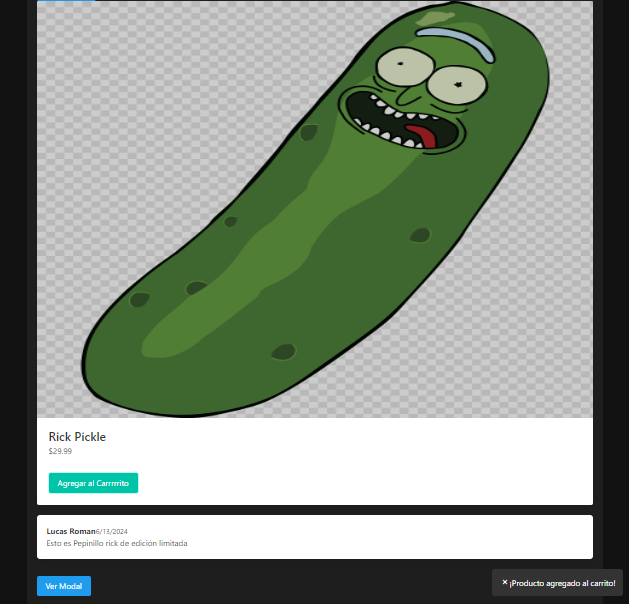

# Coloquios de Programación 3

Este repositorio contiene proyectos desarrollados como parte de los coloquios de Programación 3 utilizando React y Vite. Cada coloquio tiene su propia sección con ejemplos y prácticas específicas.
Aqui te explico como hacerlos andar por si te pitna

## Estructura del Proyecto

```plaintext
Coloquios_Progra3/
├── node_modules/
├── src/
│   ├── COLOQUIOS_PROGRA_3/
│   │   ├── COLOQUIO_1/
│   │   │   ├── components/
│   │   │   ├── styles/
│   │   │   ├── App.jsx
│   │   │   ├── index.css
│   │   │   ├── main.jsx
│   │   │   ├── index.html
│   │   │   └── README.md
│   │   ├── COLOQUIO_2/
│   │   │   └── README.md
│   ├── Separacion/
├── .gitignore
├── index.html
├── package.json
├── package-lock.json
├── README.md
└── vite.config.js
```

## Requisitos

- Node.js
- npm (Node Package Manager)

## Instalación

1. Clonar el repositorio:

    ```bash
    git clone https://github.com/lucasromanh/Coloquios_Progra3.git
    cd Coloquios_Progra3
    ```

2. Instalar las dependencias:

    ```bash
    npm install
    ```

## Ejecución del Proyecto

Para ejecutar los proyectos de los coloquios, utiliza los siguientes comandos:

### Coloquio 1:

```bash
npm run dev:coloquio1
```

### Coloquio 2:

```bash
npm run dev:coloquio2
```

## Configuración en Caso de Mover Archivos

Si necesitas mover archivos o cambiar la estructura de directorios, asegúrate de actualizar las rutas correspondientes en los siguientes archivos:

- **vite.config.js**: Actualiza la variable `root` para apuntar a la nueva ubicación del directorio del coloquio.

    ```javascript
    import { defineConfig } from 'vite';
    import react from '@vitejs/plugin-react';
    import path from 'path';
    import dotenv from 'dotenv';

    dotenv.config();

    const coloquio = process.env.COLOQUIO || 'COLOQUIO_1';

    export default defineConfig({
      plugins: [react()],
      root: path.resolve(__dirname, `src/COLOQUIOS_PROGRA_3/${coloquio}`),
      build: {
        outDir: path.resolve(__dirname, 'dist'),
      },
      server: {
        fs: {
          allow: ['..']
        }
      }
    });
    ```

- **package.json**: Asegúrate de que los scripts apunten a la ubicación correcta de los archivos del proyecto.

    ```json
    "scripts": {
      "dev:coloquio1": "cross-env COLOQUIO=COLOQUIO_1 vite",
      "dev:coloquio2": "cross-env COLOQUIO=COLOQUIO_2 vite",
      "build:coloquio1": "cross-env COLOQUIO=COLOQUIO_1 vite build",
      "build:coloquio2": "cross-env COLOQUIO=COLOQUIO_2 vite build",
      "serve:coloquio1": "cross-env COLOQUIO=COLOQUIO_1 vite preview",
      "serve:coloquio2": "cross-env COLOQUIO=COLOQUIO_2 vite preview"
    }
    ```
## Contacto

Para cualquier duda, puedes contactarme o buscarme como lucasromanh.

